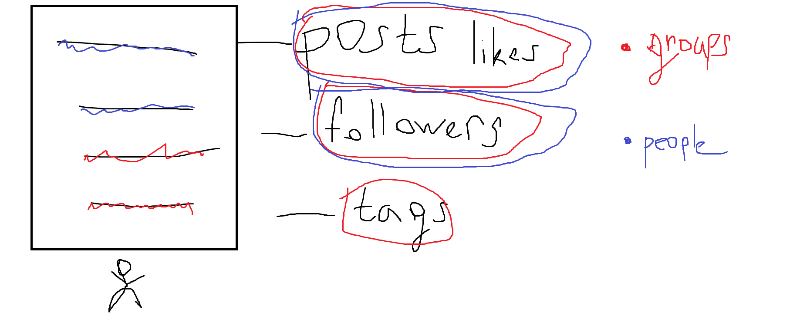

# tg-ig-helper-bot
Telegram bot for handling <b>multiple</b> instagram accounts with
<b>automated liking/following/commenting activity.</b>
 
See video short version of working https://drive.google.com/file/d/18qGIv-s4hYP1zJDWw_GdmuubSpPpLJbS/view

## Intro

I'm obsessed with Instagram! 
 
 
A few days ago one idea came to my mind. I remembered that I'm a developer so
why not to create automation tool that will handle a couple of my new ig accounts? 

You could say: "Yo, there's a lot of alike stuff on the Internet". yes.. But

If all these ig accounts would run their own life ? Interested? Ok. Read next ;)

## What I have

I have a few alike instagram accounts about drip/look/fashion. 

## What I want
Followers!

## How

By automation liking, following and commenting on their own !

## Posting picture

I send URL of post, that I would like to repost on my own account. Before that I can 
specify account where it would be posted next.  Then I type a few hashtags, bot generates full list of 30 alike 
hashtags. I also define caption to post(few words).  After that bot automatically
creates exactly same post with the same location, tag person who we copied link from,
comment generated hashtags.

**FUN** 
Furthermore, there's option, when one of accounts creates a post, my other accounts 
immediately like this post and comment it !

## Public activity

I defined  a list of groups and people(influencers) who is connected with fashion/drip.

[My idea starts] 
Every day my accounts choose randomly certain amount of these influencers, go to their pages and
scrape people to like, follow and comment in the future.

You can see. I devide groups from people influencers. 
From groups we grab <b>followers, last post likers and people, who tagged
them with that group.</b>
 
  From people we grab the same except who tagged these people on their pages, because
these tags mostly do these "fashion-inspiration groups"

And after that accounts starting live their own life liking, following and commenting people
with the limits which I've set.

#####################################
 
With that algorithm you don't need to scrape again and again new people to interact with.
Bot does it itself. You just set limits and also you could add new 
influencer accounts to scrape its auditory!

To be continued...
